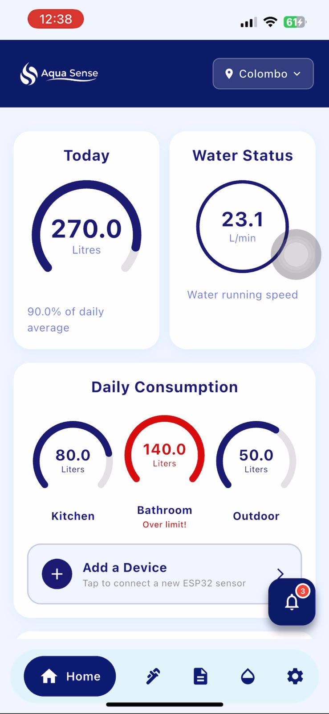
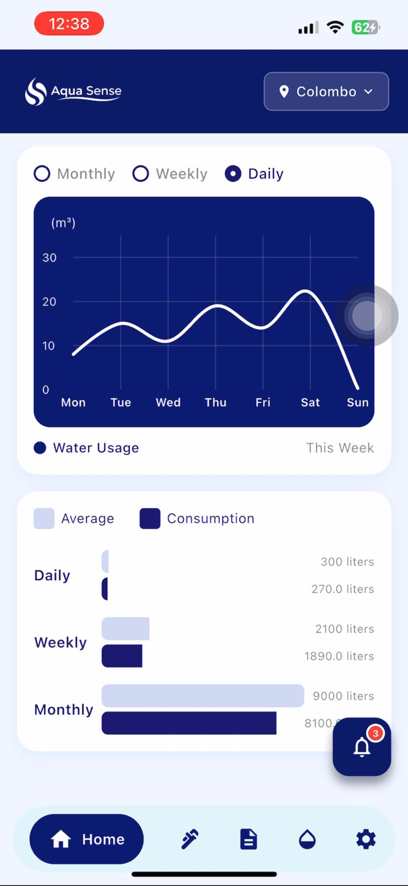
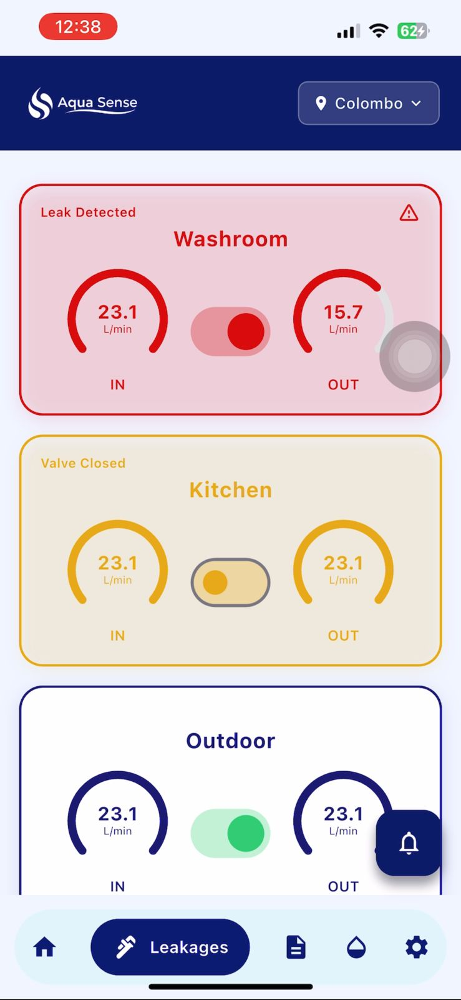
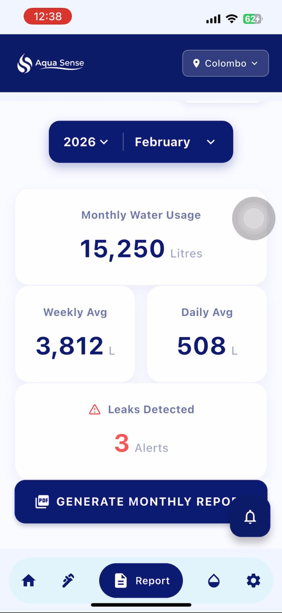
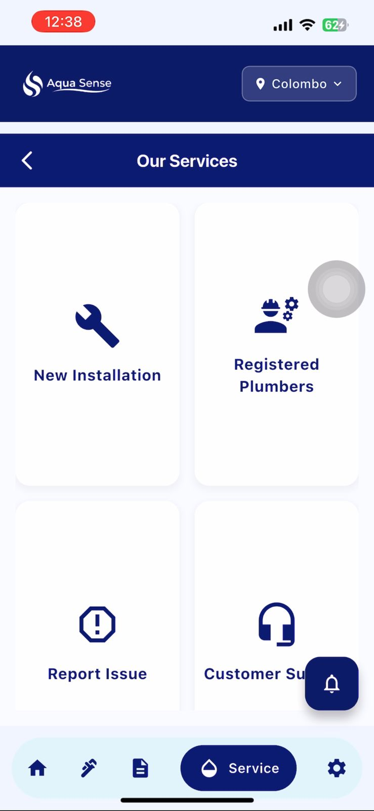
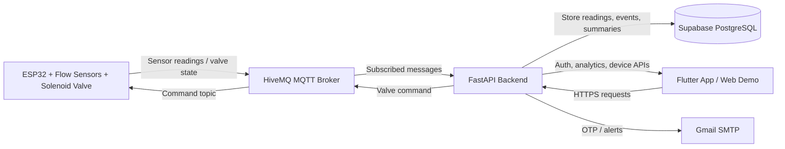

# AquaSense

**IoT-Based Smart Multi-Zone Water Management, Monitoring, and Conservation System**

AquaSense is a full-stack IoT solution designed to help households monitor water usage, detect leakages in real time, and control affected water lines using automated valve control. The system combines ESP32-based hardware, MQTT communication, a FastAPI backend, a Supabase PostgreSQL database, and a Flutter mobile/web application.

<p align="center">
  
  
  
  
  
</p>

---

## Live Project

| Service | URL |
|---|---|
| Frontend Demo | https://aquasense-sdgp.web.app |
| Backend API | https://sdgp-se24-aquasense-mobile.onrender.com |
| Health Check | https://sdgp-se24-aquasense-mobile.onrender.com/health |

> **Note:** The backend is deployed on a free Render instance, so the first request after inactivity may take 30–60 seconds. Real-time IoT readings require the ESP32 device and MQTT connection to be active.

---

## Problem Statement

Water wastage, inefficient household water consumption, and undetected leaks contribute to domestic water loss. Many existing solutions provide monitoring only, but do not combine zone-level leak detection with selective automatic valve shutoff. AquaSense addresses this by detecting abnormal flow patterns and isolating affected water lines before further wastage occurs.

---

## Solution Overview

AquaSense monitors water flow at zone level using inlet and outlet sensors connected to ESP32 microcontrollers. Sensor readings are published to HiveMQ through MQTT, processed by a FastAPI backend, stored in Supabase PostgreSQL, and visualized in the Flutter application. When a leak is detected, the system can automatically close the affected solenoid valve and notify the user.

---

## Key Features

- Real-time water usage monitoring
- Zone-level flow tracking
- Leakage detection using inlet/outlet comparison
- Automated solenoid valve control
- Remote valve open/close commands
- MQTT-based device communication
- User authentication with JWT
- OTP verification and Two-Factor Authentication
- User profile and district setup
- Usage analytics and reporting
- Daily/monthly consumption summaries
- Responsive Flutter UI with light/dark theme support
- Cloud deployment using Firebase, Render, Supabase, and HiveMQ

---

## Technology Stack

| Layer | Technology |
|---|---|
| Frontend | Flutter |
| Backend | FastAPI, Python |
| Database | Supabase PostgreSQL |
| ORM | SQLAlchemy Async |
| Authentication | JWT, OTP, bcrypt, Fernet encryption |
| IoT Device | ESP32 |
| Sensors | YF-S201 Water Flow Sensor |
| Actuator | 12V Solenoid Valve via Relay Module |
| Messaging | MQTT |
| MQTT Broker | HiveMQ Cloud |
| Frontend Hosting | Firebase Hosting |
| Backend Hosting | Render |
| Version Control | GitHub |

---

## System Architecture



More diagrams are available in [`docs/diagrams`](docs/diagrams).

---

## Repository Structure

```text
sdgp-se24-aquasense-mobile/
│
├── README.md
├── LICENSE
├── CHANGELOG.md
├── CONTRIBUTING.md
├── CODE_OF_CONDUCT.md
├── SECURITY.md
├── SUPPORT.md
├── .gitignore
├── .env.example
│
├── frontend/
│   ├── lib
│   │   ├── models
│   │   │   ├── app_notification.dart
│   │   │   ├── mobile_models.dart
│   │   │   └── usage_summary.dart
│   │   │
│   │   ├── screens
│   │   │   ├── data_service.dart
│   │   │   ├── home_page.dart
│   │   │   ├── home_screen.dart
│   │   │   ├── installation_guide_screen.dart
│   │   │   ├── installation_screen.dart
│   │   │   ├── iot_connectivity_screen.dart
│   │   │   ├── leakages_page.dart
│   │   │   ├── login_page.dart
│   │   │   ├── nwsdb_coordination_screen.dart
│   │   │   ├── plumbers_screen.dart
│   │   │   ├── profile_screen.dart
│   │   │   ├── registration_page.dart
│   │   │   ├── report_issue_screen.dart
│   │   │   ├── security_screen.dart
│   │   │   ├── services_screen.dart
│   │   │   ├── settings_screen.dart
│   │   │   ├── splash_screen.dart
│   │   │   ├── support_screen.dart
│   │   │   ├── terms_screen.dart
│   │   │   ├── theme_screen.dart
│   │   │   ├── usage_screen.dart
│   │   │   └── user_manual_screen.dart
│   │   │
│   │   ├── main.dart
│   │   └── theme_provider.dart
│   │
│   ├── services
│   │   ├── utils
│   │   │   └── app_constants.dart
│   │   │
│   │   ├── widgets
│   │   │   ├── bell_button.dart
│   │   │   ├── custom_bottom_nav.dart
│   │   │   ├── daily_consumption_card.dart
│   │   │   ├── leakage_card.dart
│   │   │   ├── service_card.dart
│   │   │   ├── support_card.dart
│   │   │   ├── today_card.dart
│   │   │   ├── usage_chart_card.dart
│   │   │   ├── usage_summary_card.dart
│   │   │   └── water_status_card.dart
│   │   │
│   │   ├── api_service.dart
│   │   ├── auth_service.dart
│   │   └── auth_storage.dart
│
├── backend/
│   ├── __pycache__/
│   │
│   ├── app
│   │   └── routes
│   │       ├── auth_routes.py
│   │       ├── district_routes.py
│   │       ├── google_auth_routes.py
│   │       ├── security_routes.py
│   │       ├── terms_routes.py
│   │       └── user_routes.py
│   │
│   ├── utils
│   │   ├── encryption.py
│   │   ├── lock_user.py
│   │   └── __init__.py
│   │
│   ├── .env
│   ├── .gitkeep
│   ├── aggregation.py
│   ├── analytics_router.py
│   ├── auth.py
│   ├── config.py
│   ├── database.py
│   ├── device_router.py
│   ├── email_utils.py
│   ├── leak_service.py
│   ├── main.py
│   ├── mobile_router.py
│   ├── models.py
│   ├── mqtt_service.py
│   ├── reports_router.py
│   ├── requirements.txt
│   ├── run.py
│   ├── schemas.py
│   └── usage_router.py
│
├── iot/
│   ├── in_mqtt_1_2_3/
│   │   └── in_mqtt_1_2_3.ino
│   │
│   └── Out_MQTT_1.1.1/
│       └── Out_MQTT_1.1.1.ino
│
├── docs/
│   ├── ARCHITECTURE.md
│   ├── API.md
│   ├── DEPLOYMENT.md
│   ├── HARDWARE.md
│   ├── TESTING.md
│   ├── CONTRIBUTIONS.md
│   ├── CASE_STUDY.md
│   ├── PORTFOLIO.md
│   ├── SOCIAL_MEDIA.md
│   ├── BRANDING.md
│   ├── SCREENSHOTS_GUIDE.md
│   ├── PROJECT_GOVERNANCE.md
│   ├── REPORT_BASED_SUMMARY.md
│   ├── REPOSITORY_SETUP.md
│   │
│   ├── diagrams/
│   │   ├── system-architecture.png
│   │   ├── data-flow.png
│   │   └── deployment-flow.png
│   │
│   └── screenshots/
│       ├── home-dashboard.png
│       ├── leakage-monitoring.png
│       ├── usage-report.png
│       ├── services-screen.png
│       ├── settings-profile.png
│       └── theme-screens.png
│
├── team/
│   ├── CONTRIBUTORS.md
│   └── ROLES.md
│
└── .github/
    ├── PULL_REQUEST_TEMPLATE.md
    ├── ISSUE_TEMPLATE/
    │   ├── bug_report.md
    │   └── feature_request.md
    │
    └── workflows/
        ├── frontend-check.yml
        └── backend-check.yml

```

---

## Team

| Member | Role | Main Focus |
|---|---|---|
| Ishan Eranga Adithya Udawatte | Project Lead & IoT Systems Engineer | ESP32 firmware, MQTT communication, leak detection logic, system integration, repository/deployment coordination |
| G. Lathmi Sandalini Wanigasekara | Backend Systems Engineer & Operations Coordinator | FastAPI backend, PostgreSQL/Supabase integration, analytics APIs, database operations |
| A. K. Ewmini Minthara Perera | Frontend Engineer & Research/Strategy Lead | Flutter authentication screens, profile/settings UI, theme management, UI consistency |
| W. M. Kulith Rahul Kusalwin | Authentication Systems Engineer | JWT auth, OTP verification, 2FA, password hashing, encryption, logout blacklist |
| H. V. Sahan Rasanga | Frontend Engineer & UI/UX Designer | Dashboard UI, zone cards, dynamic rendering, light/dark responsive UI |
| K. H. Rashan Kaveesha Kathurusinghe | Frontend Engineer & Digital Content Designer | Reports page, PDF generation, service pages, plumber directory, support modules |

See [`team/CONTRIBUTORS.md`](team/CONTRIBUTORS.md) and [`docs/CONTRIBUTIONS.md`](docs/CONTRIBUTIONS.md).

---

## Getting Started

### Backend

```bash
cd backend
python -m venv venv
source venv/bin/activate  # Windows: venv\Scripts\activate
pip install -r requirements.txt
cp ../.env.example .env
python run.py
```

Backend runs at:

```text
http://localhost:8000
```

### Frontend

```bash
cd frontend
flutter pub get
flutter run
```

For web build:

```bash
flutter build web --no-wasm-dry-run
```

### Firebase Deploy

```bash
cd frontend
flutter build web --no-wasm-dry-run
firebase deploy
```

### Render Backend Deploy

Render start command:

```bash
python run.py
```

or:

```bash
uvicorn main:app --host 0.0.0.0 --port $PORT
```

---

## Environment Variables

Never commit real credentials. Use `.env.example` as a reference.

Required backend variables include:

```env
DATABASE_URL=
JWT_SECRET=
MQTT_BROKER_HOST=
MQTT_BROKER_PORT=8883
MQTT_USERNAME=
MQTT_PASSWORD=
CORS_ALLOWED_ORIGINS=https://aquasense-sdgp.web.app
ENVIRONMENT=production
```

---

## API Overview

| Module | Example Endpoints |
|---|---|
| Auth | `POST /auth/register`, `POST /auth/login`, `POST /auth/refresh` |
| User | `GET /user/profile`, `PUT /user/update-profile` |
| Security | `POST /security/2fa/enable`, `POST /security/2fa/verify-enable` |
| District | `GET /district/my-district`, `POST /district/save` |
| Devices | Device status, valve control, registration |
| Analytics | Zone summaries, usage history, daily/monthly analytics |
| Mobile | Flutter-shaped convenience endpoints |
| System | `GET /`, `GET /health` |

Detailed API documentation is available in [`docs/API.md`](docs/API.md).

---

## Testing Summary

AquaSense was tested using functional, non-functional, usability, performance, and compatibility testing. The prototype achieved strong usability feedback, including successful completion of key tasks such as dashboard reading, valve toggling, report generation, and service lookup.

See [`docs/TESTING.md`](docs/TESTING.md).

---

## Future Enhancements

- AI-driven water consumption forecasting
- NWSDB integration for neighbourhood-level water insights
- GSM and battery backup for ESP32 nodes
- Advanced mobile push notifications
- Admin dashboard for monitoring multiple households
- Expanded leak severity classification

---

## Security Notice

This repository must not contain:

- Supabase passwords
- HiveMQ credentials
- JWT secrets
- Gmail app passwords
- Firebase private keys

Use environment variables and `.env.example` only.

---

## License

This project is provided for academic and portfolio demonstration purposes. See [`LICENSE`](LICENSE).
