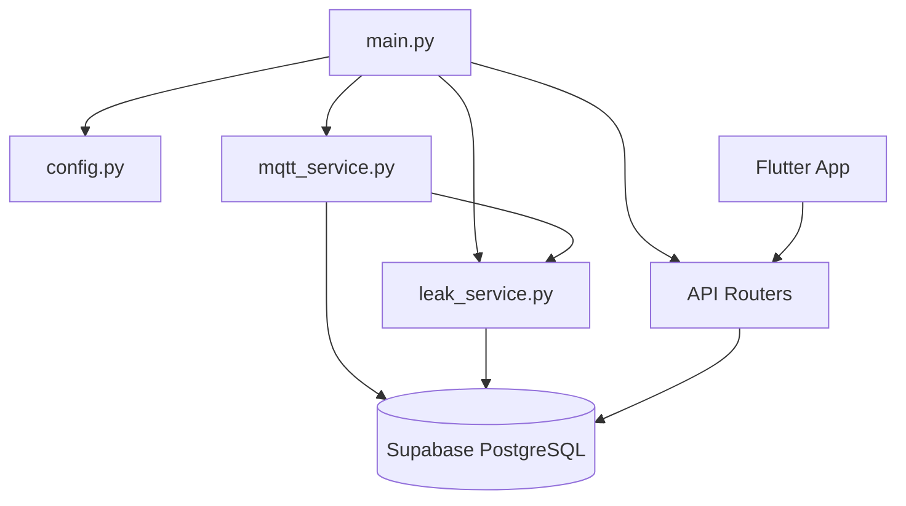
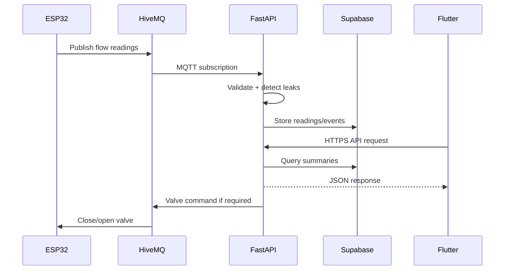

# AquaSense Architecture

AquaSense follows a distributed IoT architecture with four main layers.

## 1. Hardware / IoT Layer

The hardware layer includes ESP32 microcontrollers, YF-S201 flow sensors, relay modules, and solenoid valves. The ESP32 reads water flow pulses, calculates flow rates and volume, publishes sensor data through MQTT, and executes valve control commands.

## 2. MQTT Communication Layer

HiveMQ Cloud is used as the MQTT broker. ESP32 devices publish sensor readings and receive valve commands using structured topics.

Example topic pattern:

```text
aquasense/{network_id}/{zone_id}/{device_id}/readings
aquasense/{network_id}/{zone_id}/{device_id}/valve/command
```

## 3. Backend Layer

The backend is implemented with FastAPI. It manages:

- HTTP API routes
- Authentication and account security
- MQTT subscription and publishing
- Leak detection service
- Database writes and batch flushing
- Scheduled aggregation
- Analytics endpoints

### Backend Internal Flow



## 4. Frontend Layer

The frontend is built with Flutter using a modular layered structure:

- `screens/` for full pages
- `widgets/` for reusable UI components
- `services/` for API and storage logic
- `models/` for data models
- `theme_provider.dart` for theme state

## Data Flow


