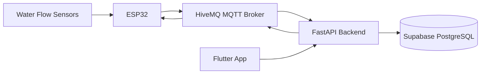

# AquaSense Case Study

## Project Summary

AquaSense is an IoT-based smart water monitoring and leakage detection platform designed for household water conservation. It monitors water flow across multiple zones, detects abnormal usage patterns, and supports automatic valve shutoff when leakage is detected.

## My Role

**Project Lead & IoT Systems Engineer**

I was responsible for the IoT and system integration side of AquaSense. My work included ESP32 firmware, sensor integration, MQTT communication, leak detection logic, testing real device data, and coordinating the full-stack system deployment.

## Challenge

Household water leaks are often detected late, leading to wastage and unnecessary cost. Traditional systems may show usage, but many do not provide automatic selective shutoff at zone level.

## Solution

AquaSense combines:

- ESP32-based flow monitoring
- MQTT communication through HiveMQ
- FastAPI backend APIs
- Supabase PostgreSQL storage
- Flutter mobile/web interface
- Automated valve control

## Architecture

## Key Engineering Decisions

### FastAPI Backend
Chosen for asynchronous support and clean API development.

### Supabase PostgreSQL
Chosen for relational structure across users, networks, zones, devices, readings, events, and logs.

### MQTT
Chosen for lightweight real-time communication between ESP32 devices and backend services.

### Flutter
Chosen for cross-platform UI development and reusable mobile/web interface.

## My Technical Contributions

- Developed IoT communication flow between ESP32 and backend
- Planned MQTT topic structure
- Tested live data from sensors
- Managed device communication reliability
- Helped connect backend services to frontend features
- Coordinated GitHub branch organization and deployment steps
- Supported Firebase and Render production deployment

## Outcome

AquaSense reached a working end-to-end deployment:

- Frontend: https://aquasense-sdgp.web.app
- Backend: https://sdgp-se24-aquasense-mobile.onrender.com
- Backend health check: https://sdgp-se24-aquasense-mobile.onrender.com/health

## What I Learned

- Real-world IoT system architecture
- MQTT-based device communication
- Cloud backend deployment
- Team-based Git workflow
- Flutter/FastAPI integration
- Production debugging across Firebase, Render, Supabase, and HiveMQ
